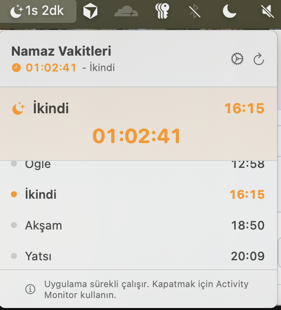

# 🚀 GitHub Setup Guide

Follow these steps to publish your PrayerTimer app to GitHub.

## 📋 Prerequisites

- GitHub account ([Sign up here](https://github.com/signup))
- Git installed on your Mac (already done ✅)
- Repository initialized locally (already done ✅)

## 🎯 Step-by-Step Instructions

### 1. Create a New Repository on GitHub

1. Go to [https://github.com/new](https://github.com/new)
2. Fill in the repository details:
   - **Repository name**: `prayertimer` (or your preferred name)
   - **Description**: `🕌 A minimal macOS menu bar app for Islamic prayer times with live countdown timer`
   - **Visibility**: 
     - ✅ **Public** (recommended for open source)
     - 🔒 **Private** (if you want to keep it private)
   - **DO NOT** initialize with README, .gitignore, or license (we already have these)
3. Click **"Create repository"**

### 2. Connect Local Repository to GitHub

After creating the repository, GitHub will show you commands. Use these:

```bash
# Navigate to your project
cd /Users/ummugulsun/prayertimer

# Add GitHub as remote origin (replace with your username)
git remote add origin https://github.com/YOUR_USERNAME/prayertimer.git

# Verify remote was added
git remote -v

# Push to GitHub
git push -u origin main
```

**Replace `YOUR_USERNAME`** with your actual GitHub username!

### 3. Verify Upload

1. Go to `https://github.com/YOUR_USERNAME/prayertimer`
2. You should see:
   - ✅ All your source files
   - ✅ README.md displayed on the homepage
   - ✅ License file
   - ✅ 1 commit

## 📸 Add Screenshots (Optional but Recommended)

1. Create a `screenshots` folder in your repo:
```bash
mkdir screenshots
```

2. Take screenshots of your app:
   - Menu bar icon
   - Dropdown menu with prayer times
   - Settings panel
   - Countdown timer in action

3. Add screenshots to folder and commit:
```bash
git add screenshots/
git commit -m "docs: add screenshots"
git push
```

4. Update README.md to include screenshots:
```markdown
## Screenshots


*Live countdown in menu bar*


*Prayer times list with next prayer highlighted*


*Manual location configuration*
```

## 🏷️ Create a Release (Optional)

1. Go to your repo: `https://github.com/YOUR_USERNAME/prayertimer`
2. Click "Releases" → "Create a new release"
3. Fill in:
   - **Tag version**: `v1.0.0`
   - **Release title**: `v1.0.0 - Initial Release`
   - **Description**: 
     ```
     ## 🎉 First Release
     
     A minimal macOS menu bar app for Islamic prayer times.
     
     ### Features
     - ⏰ Live countdown timer
     - 🌍 Manual location configuration
     - 🎨 Clean SwiftUI interface
     - 🔄 Always-on background operation
     
     ### Installation
     Download PrayerTimer.app, move to Applications, and launch!
     ```
4. Attach the built `.app` file (optional)
5. Click "Publish release"

## 🎨 Customize GitHub Repository

### Add Topics

1. Go to your repo
2. Click the ⚙️ gear icon next to "About"
3. Add topics:
   - `swift`
   - `swiftui`
   - `macos`
   - `prayer-times`
   - `islam`
   - `menu-bar-app`
   - `aladhan-api`

### Update Description

In the "About" section, add:
- Description: `🕌 Minimal macOS menu bar app for Islamic prayer times with live countdown`
- Website: (if you have one)
- Check ✅ "Use your GitHub Pages website" (if applicable)

## 🔐 Security Best Practices

### Never commit:
- ❌ API keys (if you add any)
- ❌ Personal information
- ❌ `.env` files with secrets
- ❌ Xcode user data (already in .gitignore)

### Our .gitignore already excludes:
- ✅ `xcuserdata/`
- ✅ `DerivedData/`
- ✅ `.DS_Store`
- ✅ Build artifacts

## 📊 Add Badges to README (Optional)

Add these badges to the top of your README.md:

```markdown


```

## 🤝 Enable Discussions (Optional)

1. Go to Settings → Features
2. Check ✅ "Discussions"
3. This allows users to ask questions and share ideas

## 📝 Quick Commands Reference

```bash
# Check status
git status

# Add new files
git add .

# Commit changes
git commit -m "type: description"

# Push to GitHub
git push

# Pull latest changes
git pull

# Create new branch
git checkout -b feature/new-feature

# View commit history
git log --oneline
```

## 🎉 You're Done!

Your project is now on GitHub! Share it with:
- 🐦 Twitter/X
- 💼 LinkedIn
- 📧 Muslim developer communities

---

Need help? Check [GitHub Docs](https://docs.github.com/) or open an issue!

