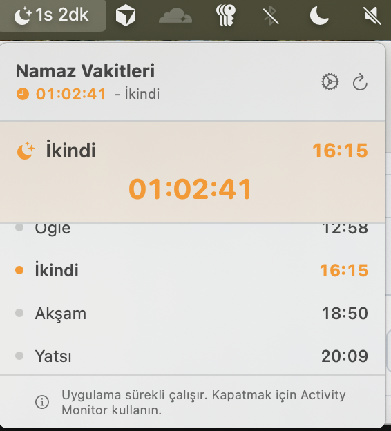
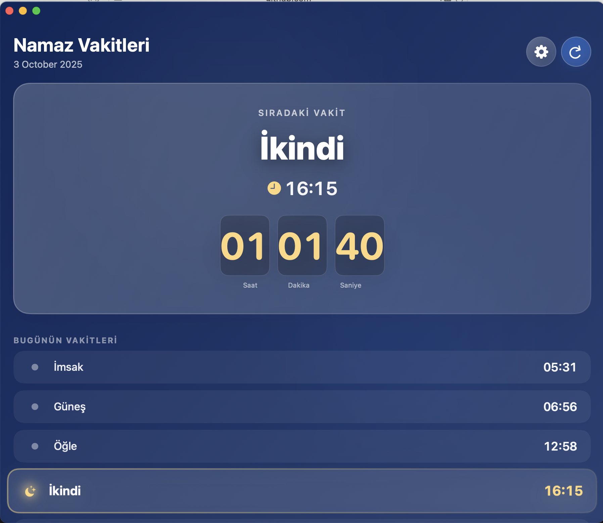

# 🕌 PrayerTimer - macOS Menu Bar Prayer Times App

A minimal, persistent macOS menu bar application that displays Islamic prayer times with a live countdown timer. Built specifically for personal use with SwiftUI and modern macOS APIs.


[](https://github.com/ummugulsunn/prayertimer/actions/workflows/macos-build.yml)

## ✨ Features

### 🔔 **Always-On Menu Bar Display**
- Persistent menu bar icon with live countdown (e.g., "2h 45m" or "45m")
- Never closes - runs continuously in the background
- No dock icon - purely menu bar focused
- Auto-updates on adaptive intervals (per-second when under one hour; less frequent when more time remains)
- Orange highlight when less than 15 minutes remain

### ⏰ **Prayer Times Management**
- Displays all 6 daily prayer times (Fajr, Sunrise, Dhuhr, Asr, Maghrib, Isha)
- Highlights the next upcoming prayer
- Live countdown timer in both menu bar and dropdown
- Automatic daily updates

### 🌍 **Flexible Location Settings**
- **Manual Location**: Enter city and country manually (default: Istanbul, Turkey)
- **Automatic Location**: Toggle GPS-based location (optional)
- Easy-to-access settings panel with gear icon

### 🎨 **Modern UI/UX**
- Clean, native macOS design using SwiftUI
- Dark mode support
- Smooth animations and transitions
- Minimal and distraction-free

### 🔐 **Privacy & Security**
- No analytics or tracking
- Location data never leaves your device
- Open source - verify the code yourself

## 📸 Screenshots

### Menu Bar
The app lives in your menu bar with a live countdown timer:


*Live countdown timer showing time remaining until next prayer*

---

### Full App View
Clean, modern interface with all prayer times and settings:


*Dropdown view showing next prayer, countdown, full schedule, and settings panel*

**Features shown:**
- 🕐 Live countdown in header
- 🌙 Next prayer highlighted in orange
- 📋 Complete daily prayer schedule
- ⚙️ Settings panel with manual location input
- 🔄 One-click refresh button

## 🚀 Installation

### Requirements
- macOS 13.0 (Ventura) or later
- Xcode 15.0 or later
- Apple Developer account (for code signing)

### Build from Source

1. **Clone the repository**
```bash
git clone https://github.com/ummugulsunn/prayertimer.git
cd prayertimer
```

2. **Open in Xcode**
```bash
open PrayerTimer.xcodeproj
```

3. **Configure signing**
   - Select the PrayerTimer target
   - Go to "Signing & Capabilities"
   - Select your development team

4. **Build and run**
   - Press `Cmd + R` or click the Run button
   - Grant location permissions if using auto-location

5. **Install permanently**
   - Build for Release configuration
   - Copy `PrayerTimer.app` to `/Applications`
   - Add to Login Items for auto-start

**Optional:** Download a **Release** `.app` zip from [GitHub Actions](https://github.com/ummugulsunn/prayertimer/actions/workflows/macos-build.yml) (latest successful run → Artifacts), or run `./scripts/build-release.sh` locally. Unsigned builds may require **Right-click → Open** the first time.

## ⚙️ Configuration

### Setting Your Location

1. Click the menu bar icon (🌙)
2. Click the gear icon (⚙️) in the header
3. Toggle "Otomatik Konum" (Auto Location) OFF
4. Enter your city and country
5. Click "Kaydet ve Güncelle" (Save and Update)

### Default Settings
- **Location Mode**: Manual
- **City**: Istanbul
- **Country**: Turkey
- **Countdown updates**: Adaptive (most frequent when the next prayer is under one hour)

## 🏗️ Architecture

### Tech Stack
- **Language**: Swift 5.9
- **UI Framework**: SwiftUI
- **Minimum macOS**: 13.0
- **API**: Aladhan Prayer Times API

### Project Structure
```
PrayerTimer/
├── Sources/
│   ├── App/
│   │   └── PrayerTimerApp.swift       # Main app & menu bar UI
│   ├── Models/
│   │   └── APIResponse.swift          # Data models
│   ├── ViewModels/
│   │   └── PrayerTimeViewModel.swift  # Business logic
│   ├── Services/
│   │   └── PrayerTimeService.swift    # API service
│   ├── Managers/
│   │   ├── LocationManager.swift      # Location handling
│   │   └── NotificationManager.swift  # Notifications
│   ├── Shared/
│   │   ├── SharedDefaults.swift       # UserDefaults wrapper
│   │   └── TimingsCodec.swift         # JSON codecs
│   └── Assets.xcassets/                 # App icons
├── PrayerTimerWidget/                 # Widget extension
└── Config/
    └── Info.plist
```

### Key Components

#### **AppDelegate**
- Menu bar accessory policy (no Dock icon by default)
- Allows intentional quit via **Shift+⌘Q** or the in-app **Quit…** confirmation; plain **⌘Q** is discouraged to avoid accidental exit

#### **MenuBarContentView**
- Main dropdown UI
- Settings panel with location configuration
- Prayer times list with live updates
- Countdown timer display

#### **PrayerTimeViewModel**
- Manages prayer times state
- Handles location (manual/auto)
- Adaptive countdown scheduling; fetches from the API when the schedule refreshes
- Fetches data from API

## 🔧 Customization

### Changing Prayer Time Calculation Method

Use the in-app **calculation method** picker (backed by `CalculationMethod` and Aladhan `method` IDs). For reference, supported methods include:

- 1: University of Islamic Sciences, Karachi
- 2: Islamic Society of North America (ISNA)
- 3: Muslim World League
- 4: Umm Al-Qura University, Makkah
- 5: Egyptian General Authority of Survey
- (and others — see `CalculationMethod.swift` and [Aladhan docs](https://aladhan.com/prayer-times-api))

### Adjusting Warning Time

Edit `PrayerTimerApp.swift`:
```swift
.foregroundColor(minutes < 15 ? .orange : .primary)
// Change 15 to your preferred warning threshold
```

## 🐛 Troubleshooting

### App Won't Start
- Check macOS version (13.0+ required)
- Verify code signing configuration
- Check Console.app for error messages

### Prayer Times Not Loading
1. Open Settings panel (gear icon)
2. Verify city/country spelling
3. Click "Kaydet ve Güncelle" to refresh
4. Check internet connection

### Menu Bar Icon Not Appearing
- Quit and relaunch the app
- Check System Settings > Menu Bar settings
- Ensure app has proper permissions

### Countdown Not Updating
- App automatically starts countdown on launch
- Verify the app is running (check Activity Monitor)
- If frozen, force quit and relaunch

## 🚫 Known Limitations

- **Quitting**: Use **Shift+⌘Q** (*Prayer Timer'dan Çıkış*) or **Quit…** in the popover; plain **⌘Q** is intentionally awkward for a menu bar app
- **Manual installation required**: Not on the Mac App Store by default (see `APP_STORE_CONNECT.md` if you publish yourself)
- **Requires internet**: For fetching prayer times
- **Single timezone**: Based on provided location only

## 🛠️ Development

### Running in Debug Mode
```bash
xcodebuild -project PrayerTimer.xcodeproj -scheme PrayerTimer -configuration Debug build
```

### Building for Release
```bash
xcodebuild -project PrayerTimer.xcodeproj -scheme PrayerTimer -configuration Release build
```

### Code Signing
Update `project.yml` with your team ID:
```yaml
DEVELOPMENT_TEAM: "YOUR_TEAM_ID"
```

## 📝 API Reference

This app uses the [Aladhan Prayer Times API](https://aladhan.com/prayer-times-api):

**Endpoint**: `https://api.aladhan.com/v1/timings`

**Parameters**:
- `date`: Calendar day (`DD-MM-YYYY`) for the request
- `latitude` / `longitude`: Coordinates (from manual geocode or GPS)
- `method`: Calculation method (optional; from in-app selection)

The response includes `data.meta.timezone` (IANA), used when assembling local `Date` values from the returned time strings.

## 🤝 Contributing

This is a personal project, but suggestions and improvements are welcome!

1. Fork the repository
2. Create a feature branch (`git checkout -b feature/amazing-feature`)
3. Commit your changes (`git commit -m 'Add amazing feature'`)
4. Push to the branch (`git push origin feature/amazing-feature`)
5. Open a Pull Request

## 📄 License

This project is licensed under the MIT License - see the [LICENSE](LICENSE) file for details.

## 🙏 Acknowledgments

- [Aladhan API](https://aladhan.com/) for prayer times data
- Apple's SwiftUI framework for modern UI development
- Islamic Society of North America (ISNA) for calculation methods

## 📧 Contact

Created for personal use by [@ummugulsunn](https://github.com/ummugulsunn)

---

**Note**: This app was built for personal use and may not cover all edge cases or regional variations. Use at your own discretion and always verify prayer times with local mosques or authorities.

## 🎯 Roadmap

Future improvements (maybe):
- [x] Widget support for Notification Center
- [ ] Multiple location profiles
- [x] Prayer time notifications
- [ ] Qibla direction indicator
- [ ] Hijri calendar integration
- [ ] Customizable themes

---

Made with ❤️ for the Muslim community
